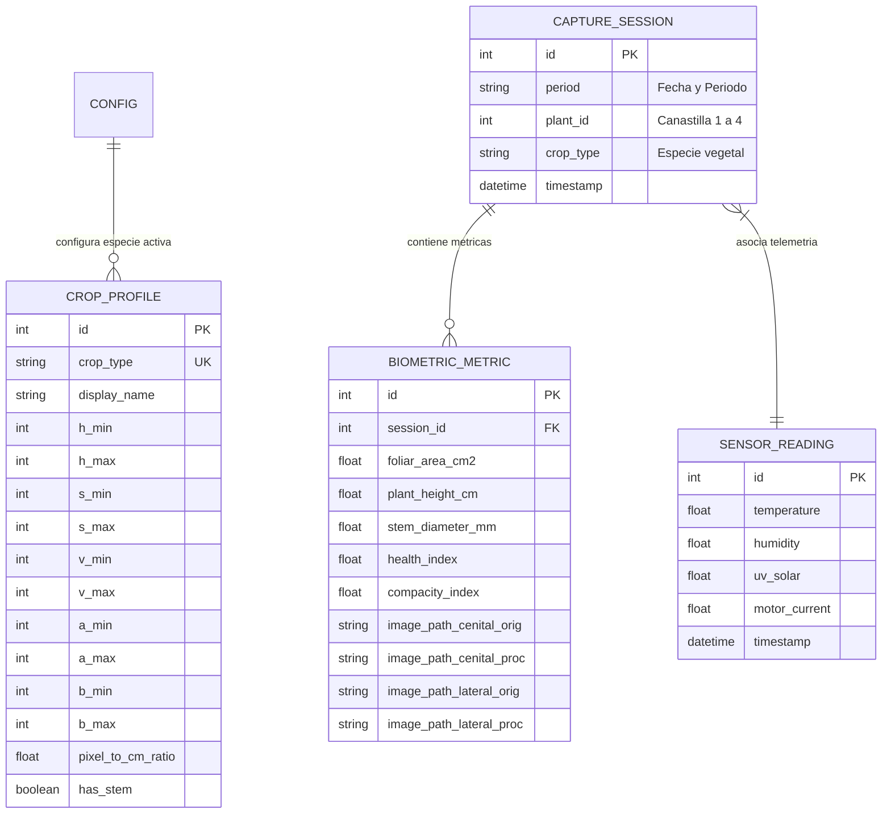

# Documentación Técnica Exhaustiva: Sistema SIFMA
### *Sistema Integral de Fenotipado y Monitoreo Agrícola en Torres Hidropónicas Verticales*

---

## 1. Resumen Ejecutivo y Propósito

El proyecto **SIFMA** es una plataforma tecnológica integral diseñada para la automatización del fenotipado no destructivo, la inspección fitosanitaria y el análisis biométrico en cultivos hidropónicos verticales. El sistema permite registrar con precisión milimétrica la evolución del crecimiento vegetal (**área foliar, altura de planta, diámetro del tallo basal e índice de salud clorofílica**) operando en condiciones de campo **100% offline**, sin requerir conexión a internet ni enlaces inalámbricos permanentes.

---

## 2. Arquitectura General y Topología del Sistema

El sistema se basa en una arquitectura desacoplada y modular compuesta por dos subsistemas autónomos:

```
                      +-------------------------------------------------------------+
                      |         TORRE HIDROPÓNICA VERTICAL (CAMPO / OFFLINE)        |
                      |                                                             |
                      |   [ Canastilla #1 ]  ---> Nodo Raspberry Pi 1 (Cámaras/Sens)|
                      |   [ Canastilla #2 ]  ---> Nodo Raspberry Pi 2 (Cámaras/Sens)|
                      |   [ Canastilla #3 ]  ---> Nodo Raspberry Pi 3 (Cámaras/Sens)|
                      |   [ Canastilla #4 ]  ---> Nodo Raspberry Pi 4 (Cámaras/Sens)|
                      +------------------------------+------------------------------+
                                                     |
                                            (Extracción Física)
                                                     |
                                                     v
                                      +-------------------------------+
                                      |   MEMORIA USB CON ALMACENAMIENTO
                                      |   SIFMA_CAPTURES/YYYY-MM-DD/     |
                                      |    ├── manana/                   |
                                      |    ├── medio_dia/                |
                                      |    └── tarde/                    |
                                      +--------------+----------------+
                                                     |
                                            (Inserción / Drag&Drop)
                                                     |
                                                     v
                      +-------------------------------------------------------------+
                      |               SERVIDOR LOCAL SIFMA (PC / LAPTOP)            |
                      |                                                             |
                      |  1. Escaneo Automático USB / Drag & Drop                    |
                      |  2. Pipeline Visión Computacional (OpenCV / PlantCV)        |
                      |  3. Base de Datos SQLite (Histórico & Sobreescritura)       |
                      |  4. Dashboard Web Interactivo (Chart.js / Comparador)       |
                      +-------------------------------------------------------------+
```

1. **Nodos de Captura de Campo (`raspi_node/`)**: Nodos embebidos instalados en cada una de las **4 canastillas** de la torre hidropónica. Alimentados mediante un temporizador de batería físico que energiza el nodo 10 minutos antes de cada ventana de muestreo (**07:00 Mañana, 12:00 Mediodía, 17:00 Tarde**). Capturan 5 fotos cenitales (cámara superior) y 5 fotos laterales (cámara de perfil), adquieren datos ambientales y guardan el lote estructurado en la memoria USB.
2. **Servidor y Procesamiento Local (`local_server/`)**: Aplicación web y motor de procesamiento ejecutado en la computadora del operador. Lee la memoria USB o archivos cargados, aplica visión artificial mediante filtros de color HSV/LAB y algoritmos morfométricos, almacena las métricas en base de datos local y presenta paneles analíticos interactivos.

---

## 3. Stack Tecnológico, Lenguajes y Librerías

### 3.1. Lenguajes de Programación
- **Python 3.10+**: Lenguaje central utilizado tanto en el nodo Raspberry Pi como en el servidor local. Se implementó bajo arquitectura orientada a objetos (OOP), modularidad estricta y tipado estructurado.
- **JavaScript (ES6+)**: Lógica e interactividad del cliente (asincronía con `fetch()`, manipulación del DOM, sincronización de sliders antes/después y animación de barras de progreso).
- **HTML5 & CSS3**: Maquetación semántica y diseño visual personalizado utilizando **Vanilla CSS** con sistema de variables de diseño, bordes vítreos (*Glassmorphism*), diseño responsivo y tema oscuro/claro de alto contraste.

### 3.2. Frameworks y Librerías del Servidor Local (`local_server`)
| Tecnología | Versión / Tipo | Función en el Sistema |
| :--- | :--- | :--- |
| **Flask** | Framework Web | Núcleo del servidor web local, ruteo mediante Blueprints y gestión de sesiones. |
| **SQLAlchemy** | ORM (Object-Relational Mapping) | Abstracción de base de datos, consultas relacionales y persistencia de modelos. |
| **SQLite3** | Base de Datos Embebida | Archivo `sifma.db` autocontenido, libre de configuración y de alto rendimiento. |
| **OpenCV (`cv2`)** | Visión por Computadora | Conversión de espacios de color (BGR a HSV/LAB), segmentación de máscaras, operaciones morfológicas, cálculo de contornos y dibujo de superposiciones. |
| **NumPy** | Computación Numérica | Procesamiento matricial de imágenes, cálculo de percentiles, medianas, envolturas convexas y filtrado estadístico robusto de valores atípicos (+- 2 sigma). |
| **Chart.js** | Visualización de Datos | Renderizado de curvas de crecimiento foliar, altura, tallo, salud y telemetría climática. |

### 3.3. Tecnologías y Librerías del Nodo Raspberry Pi (`raspi_node`)
| Tecnología | Tipo | Función en el Sistema |
| :--- | :--- | :--- |
| **Picamera2 / OpenCV VideoCapture** | API de Captura | Control de hardware de sensores de cámara CMOS (cenital y lateral). |
| **I2C / SPI / GPIO** | Protocolos Hardware | Lectura de sensores ambientales (temperatura, humedad, luxómetro UV, corriente de bomba). |
| **Platform / OS Filesystem** | Módulos del Sistema | Detección automática de puntos de montaje USB en Linux (`/media/pi/`) y Windows. |

---

## 4. Desglose del Nodo Raspberry Pi (`raspi_node/`)

### 4.1. Flujo de Ejecución Autónomo
El script principal [main_capture.py](file:///c:/Luna-Dev%20Compartido/Dev/Luna%20-%20Personal/SIFMA/raspi_node/main_capture.py) se ejecuta al arrancar el sistema operativo de la Raspberry Pi:

1. **Detección del Período Horario (`determine_period`)**:
   - Lee el reloj de tiempo real (RTC) de la Raspberry Pi.
   - Si la hora es menor a las 10:00 -> `manana`.
   - Si la hora está entre 10:00 y 15:00 -> `medio_dia`.
   - Si la hora es posterior a las 15:00 -> `tarde`.
2. **Adquisición de Sensores (`SensorReadingService`)**:
   - Lee los sensores ambientales conectados y genera un diccionario con temperatura (grados Celsius), humedad relativa (%), radiación solar UV (lux) y corriente del motor (A).
3. **Estructuración en la Memoria USB (`OfflineStorageService`)**:
   - Localiza la memoria USB conectada y crea la jerarquía:
     ```text
     SIFMA_CAPTURES/YYYY-MM-DD/[manana | medio_dia | tarde]/
     ```
4. **Captura Secuencial de Imágenes (`CameraCaptureService`)**:
   - Dispara la **Cámara Cenital** (índice 0) 5 veces con intervalo de 1 segundo -> `cenital_1.png` a `cenital_5.png`.
   - Dispara la **Cámara Lateral** (índice 1) 5 veces con intervalo de 1 segundo -> `lateral_1.png` a `lateral_5.png`.
5. **Generación de Metadatos (`metadata.json`)**:
   - Serializa los datos del lote: marca de tiempo ISO, período, fecha, canastilla (`plant_id`), especie vegetal y lecturas de sensores.

---

## 5. Desglose del Servidor Local (`local_server/`)

### 5.1. Patrón Arquitectónico del Backend
El backend está construido bajo el **Application Factory Pattern** (`create_app()`) en [app.py](file:///c:/Luna-Dev%20Compartido/Dev/Luna%20-%20Personal/SIFMA/local_server/app.py), modularizando las rutas mediante dos Blueprints:
- **`dashboard_bp.py`**: Renderizado de interfaces de usuario (Dashboard, Procesamiento, Galería, Sensores, Configuración).
- **`api_bp.py`**: Endpoints REST JSON para escaneo de memorias USB (`/api/scan_usb`), procesamiento de rutas USB (`/api/process_usb_path`) y carga de archivos manuales (`/api/upload_manual_batch`).

### 5.2. Pipeline de Visión Computacional (`core/vision/`)

El procesamiento biométrico se divide en 4 etapas matemáticas:

#### A. Segmentación Cromática Dual y Filtrado Morfológico ([segmentation.py](file:///c:/Luna-Dev%20Compartido/Dev/Luna%20-%20Personal/SIFMA/local_server/core/vision/segmentation.py))
1. **Espacio HSV**: Aísla el espectro de color verde de la clorofila mediante umbrales inferior [H_min, S_min, V_min] y superior [H_max, S_max, V_max].
2. **Espacio CIELAB**: Aísla la canopia y descarta reflectancias metálicas, tuberías de PVC o sustratos mediante el canal a (eje verde-rojo) y canal b (eje azul-amarillo).
3. **Mecanismo de Fusión y Fallback**:
   Mascara Final = Mascara_HSV AND Mascara_LAB
   *Si la combinación lógica resulta vacía por sobre-restricción del canal LAB, el sistema conmuta automáticamente a Mascara_HSV garantizando robustez total.*
4. **Limpieza Morfológica**: Se aplica operación de Cierre (Morphology_Close) seguida de Apertura (Morphology_Open) con un elemento estructurante elíptico de 3x3 para eliminar ruido sal-y-pimienta y rellenar oquedades foliares.

#### B. Cálculo de Biometría Foliar y Morfometría ([metrics.py](file:///c:/Luna-Dev%20Compartido/Dev/Luna%20-%20Personal/SIFMA/local_server/core/vision/metrics.py))
- **Área Foliar (cm2)**:
  Area Foliar = (Suma de Pixeles de Contornos Validos) * (Ratio_px_cm)^2
- **Índice de Compacidad**:
  Compacidad = (4 * PI * Area del Contorno Mayor) / (Perimetro^2)
- **Altura de la Planta (cm)**:
  Calculada en la toma lateral desde el ápice más alto del follaje (y_min) hasta el borde basal de la canastilla hidropónica (y_base = 0.73 * altura imagen):
  Altura = (y_base - y_min) * Ratio_px_cm
- **Diámetro del Tallo Basal (mm)**:
  Muestreo horizontal entre 3 y 8 píxeles por encima del borde de la canastilla, extrayendo la mediana del ancho de la columna vegetal.
- **Índice de Salud Foliar (%)**:
  Porcentaje de píxeles que caen en el rango de reflectancia verde óptimo (H en [38, 82]) respecto al área foliar total segmentada.

#### C. Superposición Visual y Trazado de Contorno en ROJO ([pipeline.py](file:///c:/Luna-Dev%20Compartido/Dev/Luna%20-%20Personal/SIFMA/local_server/core/vision/pipeline.py))
- Todos los contornos de las hojas se dibujan en **ROJO PURO** (`BGR: (0, 0, 255)`) con grosor de 2 píxeles.
- Se calcula la **Envoltura Convexa (Convex Hull)** que encierra perimetralmente toda la canopia de la planta para que el operador visualice con total claridad el área cubierta.
- **Filtrado Estadístico de Outliers**: Para las 5 fotos de cada sesión, se calcula el promedio robusto eliminando tomas atípicas que se desvíen más de +- 2 desviaciones estándar (+- 2 sigma).

---

## 6. Módulos de la Interfaz de Usuario y Vistas

### 6.1. Monitoreo Principal ([dashboard.html](file:///c:/Luna-Dev%20Compartido/Dev/Luna%20-%20Personal/SIFMA/local_server/templates/dashboard.html))
- **Tarjetas KPI**: Muestran en tiempo real el área foliar estimada, altura, diámetro de tallo e índice de salud de la última sesión.
- **Gráfica de Crecimiento Biométrico**: Trazo temporal continuo (Chart.js) que muestra la curva de desarrollo vegetal para la canastilla activa.

### 6.2. Procesamiento e Importación ([processing.html](file:///c:/Luna-Dev%20Compartido/Dev/Luna%20-%20Personal/SIFMA/local_server/templates/processing.html))
- **Soporte Multi-Canastilla**: Selector inferior para conmutar entre **Canastilla #1, #2, #3 y #4**.
- **Calendario Único de Muestreo**: Selector `<input type="date">` para asignar la fecha exacta del lote.
- **Indicador de Fechas Registradas**: Muestra distintivos con las fechas ya procesadas.
- **Advertencia de Sobreescritura**: Si el operador procesa una fecha que ya existía (por ejemplo, corrección de datos), se muestra un aviso ámbar y el botón cambia a sobreescribir, actualizando la base de datos sin duplicar registros.
- **Barra de Progreso Dinámica**: Animación en tiempo real de **0% a 100%** durante el análisis computacional.

### 6.3. Galería y Comparador Deslizante ([gallery.html](file:///c:/Luna-Dev%20Compartido/Dev/Luna%20-%20Personal/SIFMA/local_server/templates/gallery.html))
- **Filtros de Período Normalizados**: Botones interactivos para filtrar entre **Todos los Períodos**, **Mañana (07:00)**, **Mediodía (12:00)** y **Tarde (17:00)** con algoritmo que ignora acentos o mayúsculas.
- **Visor Comparador Antes/Después de 420px**: Marco de altura ampliada donde la imagen original y la máscara procesada con contornos rojos se superponen exactamente con un control deslizante.

### 6.4. Calibración de Perfiles Vegetales ([config.html](file:///c:/Luna-Dev%20Compartido/Dev/Luna%20-%20Personal/SIFMA/local_server/templates/config.html))
- Sliders en tiempo real para ajustar umbrales HSV (H, S, V), LAB (a, b), relación de escala física (cm/px) y switch de morfología con tallo principal.
- **Tooltips Contextuales**: Indicadores de ayuda en cada parámetro que explican el efecto biológico de aumentar o disminuir cada valor.
- Botón **"Guardar y Activar Calibración"** que persiste la configuración seleccionada para futuros procesamientos.

---

## 7. Esquema de Base de Datos (`sifma.db`)



---

## 8. Guía Rápida de Ejecución

1. **Iniciar el Servidor Web**:
   ```bash
   python local_server/app.py
   ```
2. **Acceder a la Plataforma**:
   - Abrir en el navegador: `http://127.0.0.1:5000`
   - Credenciales por defecto: Usuario: `admin` | Contraseña: `sifma2026`
3. **Ejecutar Captura en Raspberry Pi**:
   ```bash
   python raspi_node/main_capture.py
   ```
