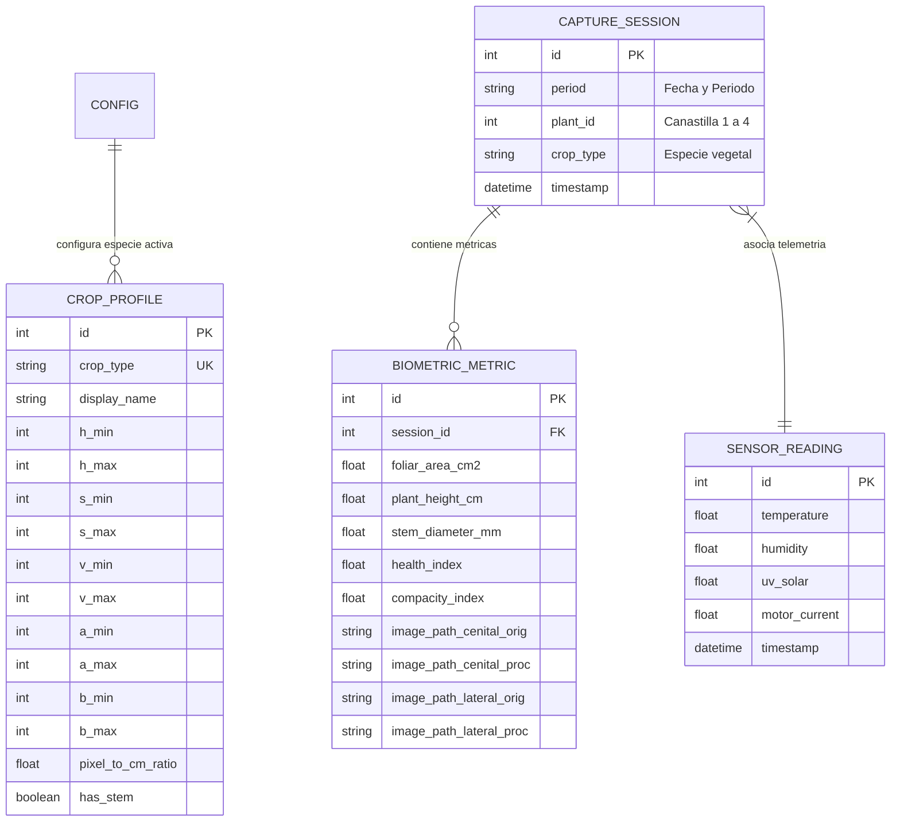

# Documentación Técnica Exhaustiva: Sistema SIFMA
### *Sistema Integral de Fenotipado y Monitoreo Agrícola en Torres Hidropónicas Verticales*

---

## 1. Resumen Ejecutivo y Propósito

El proyecto **SIFMA** es una plataforma tecnológica integral diseñada para la automatización del fenotipado no destructivo, la inspección fitosanitaria y el análisis biométrico en cultivos hidropónicos verticales. El sistema permite registrar con precisión milimétrica la evolución del crecimiento vegetal (**área foliar, altura de planta, diámetro del tallo basal e índice de salud clorofílica**) operando en condiciones de campo mediante un esquema híbrido y desacoplado:

1. **Captura visual autónoma en campo**: Nodos de visión basados en Raspberry Pi dedicados exclusivamente a la adquisición de imágenes multiespectrales/RGB de alta resolución.
2. **Telemetría ambiental inalámbrica**: Módulos de sensado agronómico que transmiten lecturas ambientales mediante un enlace de radiofrecuencia/red local hacia una antena receptora conectada por USB a la computadora central.
3. **Procesamiento analítico centralizado**: Servidor local que consolida los datos biométricos y la telemetría climática sin requerir conexión a internet.

---

## 2. Arquitectura General y Topología del Sistema

El sistema se estructura en tres subsistemas claramente diferenciados:

```
                      +-------------------------------------------------------------+
                      |         TORRE HIDROPÓNICA VERTICAL (CAMPO / OFFLINE)        |
                      |                                                             |
                      |   [ Canastilla #1 ]  ---> Nodo RPi 1 (Cámara Cenital/Lateral)|
                      |   [ Canastilla #2 ]  ---> Nodo RPi 2 (Cámara Cenital/Lateral)|
                      |   [ Canastilla #3 ]  ---> Nodo RPi 3 (Cámara Cenital/Lateral)|
                      |   [ Canastilla #4 ]  ---> Nodo RPi 4 (Cámara Cenital/Lateral)|
                      |                                                             |
                      |   [ Módulo de Sensores ] ---> Transmisor Inalámbrico RF     |
                      +-------------------+--------------------+--------------------+
                                          |                    |
                                 (Extracción USB)       (Señal Inalámbrica RF)
                                          |                    |
                                          v                    v
                      +-----------------------+     +-------------------------------+
                      | MEMORIA USB DE CAMPO  |     | ANTENA RECEPTORA DE RED LOCAL |
                      | SIFMA_CAPTURES/       |     | Conectada por USB a la PC     |
                      +-----------+-----------+     +---------------+---------------+
                                  |                                 |
                                  +----------------+----------------+
                                                   |
                                                   v
                      +-------------------------------------------------------------+
                      |               SERVIDOR LOCAL SIFMA (PC / LAPTOP)            |
                      |                                                             |
                      |  1. Escaneo Automático USB de Imágenes / Drag & Drop        |
                      |  2. Recepción de Telemetría desde Antena USB Local          |
                      |  3. Pipeline Visión Computacional (OpenCV / PlantCV)        |
                      |  4. Base de Datos SQLite (Histórico & Sobreescritura)       |
                      |  5. Dashboard Web Interactivo (Chart.js / Comparador)       |
                      +-------------------------------------------------------------+
```

1. **Nodos de Visión Raspberry Pi (`raspi_node/`)**: Nodos embebidos instalados en cada una de las 4 canastillas de la torre. Su función exclusiva es el disparo programado de cámaras cenitales y laterales y el almacenamiento ordenado en la memoria USB.
2. **Estación de Telemetría y Antena Receptora USB**: Los sensores ambientales (temperatura, humedad, radiación UV, corriente del motor de recirculación) operan de forma independiente y transmiten sus mediciones por señal inalámbrica hacia la antena receptora conectada por USB a la PC.
3. **Servidor Local SIFMA (`local_server/`)**: Aplicación web ejecutada en la computadora que procesa las imágenes de la memoria USB, recibe la telemetría directa desde la antena y presenta las curvas de crecimiento y monitoreo en tiempo real.

---

## 3. Stack Tecnológico, Lenguajes y Librerías

### 3.1. Lenguajes de Programación
- **Python 3.10+**: Lenguaje central para los nodos de captura y el servidor web local.
- **JavaScript (ES6+)**: Interactividad del cliente web, gráficos con Chart.js, peticiones asíncronas y control del comparador de imágenes.
- **HTML5 & CSS3**: Estructura semántica y diseño visual mediante Vanilla CSS basado en variables, tarjetas traslúcidas (Glassmorphism) y adaptabilidad responsiva.

### 3.2. Frameworks y Librerías del Servidor Local (`local_server`)
| Tecnología | Tipo | Función en el Sistema |
| :--- | :--- | :--- |
| **Flask** | Framework Web | Servidor web central, ruteo mediante Blueprints y gestión de sesiones. |
| **SQLAlchemy** | ORM | Mapeo objeto-relacional y persistencia de métricas y telemetría. |
| **SQLite3** | Base de Datos | Motor de base de datos relacional ligero contenido en `sifma.db`. |
| **OpenCV (`cv2`)** | Visión por Computadora | Procesamiento matricial, conversiones HSV/LAB, máscaras morfológicas y trazado de contornos. |
| **NumPy** | Computación Numérica | Operaciones algebraicas sobre matrices de imagen y filtrado estadístico (+- 2 sigma). |
| **Chart.js** | Visualización | Gráficos dinámicos de curvas biométricas y lecturas climatológicas. |

### 3.3. Tecnologías y Librerías del Nodo Raspberry Pi (`raspi_node`)
| Tecnología | Tipo | Función en el Sistema |
| :--- | :--- | :--- |
| **Picamera2 / OpenCV VideoCapture** | API de Captura | Control de hardware para cámaras cenitales y laterales. |
| **Platform / OS Filesystem** | Módulos del Sistema | Detección automática de memorias USB en Linux y Windows. |

---

## 4. Desglose del Nodo Raspberry Pi (`raspi_node/`)

### 4.1. Flujo de Ejecución Autónomo
El script principal [main_capture.py](file:///c:/Luna-Dev%20Compartido/Dev/Luna%20-%20Personal/SIFMA/raspi_node/main_capture.py) opera de forma dedicada para la captura fotográfica:

1. **Detección del Período Horario (`determine_period`)**:
   - Consulta el reloj del sistema:
     - Antes de 10:00 -> `manana`.
     - Entre 10:00 y 15:00 -> `medio_dia`.
     - Posterior a 15:00 -> `tarde`.
2. **Estructuración en Memoria USB (`OfflineStorageService`)**:
   - Detecta la unidad USB conectada y crea la estructura correspondiente:
     ```text
     SIFMA_CAPTURES/YYYY-MM-DD/[manana | medio_dia | tarde]/
     ```
3. **Captura Secuencial de Imágenes (`CameraCaptureService`)**:
   - Cámara Cenital (índice 0): 5 tomas consecutivas -> `cenital_1.png` a `cenital_5.png`.
   - Cámara Lateral (índice 1): 5 tomas consecutivas -> `lateral_1.png` a `lateral_5.png`.
4. **Serialización de Metadatos (`metadata.json`)**:
   - Registra fecha, período, identificador de canastilla (`plant_id`), especie vegetal y confirmación de captura.

---

## 5. Desglose del Servidor Local (`local_server/`)

### 5.1. Arquitectura del Backend
Implementado con el patrón Application Factory en [app.py](file:///c:/Luna-Dev%20Compartido/Dev/Luna%20-%20Personal/SIFMA/local_server/app.py) y dividido en dos módulos funcionales:
- **`dashboard_bp.py`**: Interfaz de usuario (Monitoreo, Procesamiento, Galería, Sensores, Configuración).
- **`api_bp.py`**: API REST para escaneo de memorias USB, procesamiento de lotes y recepción de datos.

### 5.2. Pipeline de Visión Computacional (`core/vision/`)

#### A. Segmentación Cromática Dual y Filtrado Morfológico ([segmentation.py](file:///c:/Luna-Dev%20Compartido/Dev/Luna%20-%20Personal/SIFMA/local_server/core/vision/segmentation.py))
1. **Espacio HSV**: Aislamiento del rango espectral de clorofila.
2. **Espacio CIELAB**: Rechazo de fondos no biológicos y reflectancias mediante canales a y b.
3. **Fusión con Fallback de Seguridad**:
   Mascara Final = Mascara_HSV AND Mascara_LAB
   *Si el canal LAB resulta sobre-restrictivo, el sistema conmuta automáticamente a Mascara_HSV.*
4. **Limpieza Morfológica**: Filtros de Cierre y Apertura para eliminar imperfecciones sin reducir el área foliar real.

#### B. Cálculo Biométrico ([metrics.py](file:///c:/Luna-Dev%20Compartido/Dev/Luna%20-%20Personal/SIFMA/local_server/core/vision/metrics.py))
- **Área Foliar (cm2)**:
  Area Foliar = (Suma de Pixeles de Contornos Validos) * (Ratio_px_cm)^2
- **Compacidad**:
  Compacidad = (4 * PI * Area del Contorno Mayor) / (Perimetro^2)
- **Altura de Planta (cm)**:
  Distancia vertical entre el borde de la canastilla (y_base) y el punto apical más elevado (y_min).
- **Diámetro del Tallo Basal (mm)**:
  Mediana del ancho de la columna del tallo muestreada en la base.
- **Índice de Salud Foliar (%)**:
  Relación porcentual de píxeles en reflectancia verde óptima frente al área total segmentada.

#### C. Superposición Visual en ROJO ([pipeline.py](file:///c:/Luna-Dev%20Compartido/Dev/Luna%20-%20Personal/SIFMA/local_server/core/vision/pipeline.py))
- Contornos de la planta y envolvente convexa perimetral dibujados en **ROJO PURO** (`BGR: (0, 0, 255)`).
- Filtrado estadístico robusto de valores atípicos (+- 2 sigma) sobre las 5 tomas de cada muestreo.

---

## 6. Módulos de la Interfaz de Usuario

### 6.1. Monitoreo Principal ([dashboard.html](file:///c:/Luna-Dev%20Compartido/Dev/Luna%20-%20Personal/SIFMA/local_server/templates/dashboard.html))
- Indicadores biométricos clave y gráfico de evolución temporal del cultivo.

### 6.2. Procesamiento e Importación ([processing.html](file:///c:/Luna-Dev%20Compartido/Dev/Luna%20-%20Personal/SIFMA/local_server/templates/processing.html))
- Selector de fecha por calendario único, soporte para Canastillas #1 a #4, control de sobreescritura y barra de progreso dinámica (0% a 100%).

### 6.3. Galería y Comparador ([gallery.html](file:///c:/Luna-Dev%20Compartido/Dev/Luna%20-%20Personal/SIFMA/local_server/templates/gallery.html))
- Comparador deslizante antes/después con altura de 420px y filtros de período flexibles (Todos, Mañana, Mediodía, Tarde).

### 6.4. Telemetría Ambiental ([sensors.html](file:///c:/Luna-Dev%20Compartido/Dev/Luna%20-%20Personal/SIFMA/local_server/templates/sensors.html))
- Visualización de datos climáticos recibidos a través de la antena USB conectada a la computadora central.

### 6.5. Calibración ([config.html](file:///c:/Luna-Dev%20Compartido/Dev/Luna%20-%20Personal/SIFMA/local_server/templates/config.html))
- Configuración de parámetros cromáticos y biométricos con tooltips explicativos.

---

## 7. Esquema de Base de Datos (`sifma.db`)



---

## 8. Guía Rápida de Ejecución

1. **Iniciar el Servidor Web Central**:
   ```bash
   python local_server/app.py
   ```
2. **Acceder a la Plataforma**:
   - Navegador web: `http://127.0.0.1:5000`
   - Credenciales: Usuario: `admin` | Contraseña: `sifma2026`
3. **Ejecutar Captura Fotográfica en Raspberry Pi**:
   ```bash
   python raspi_node/main_capture.py
   ```
