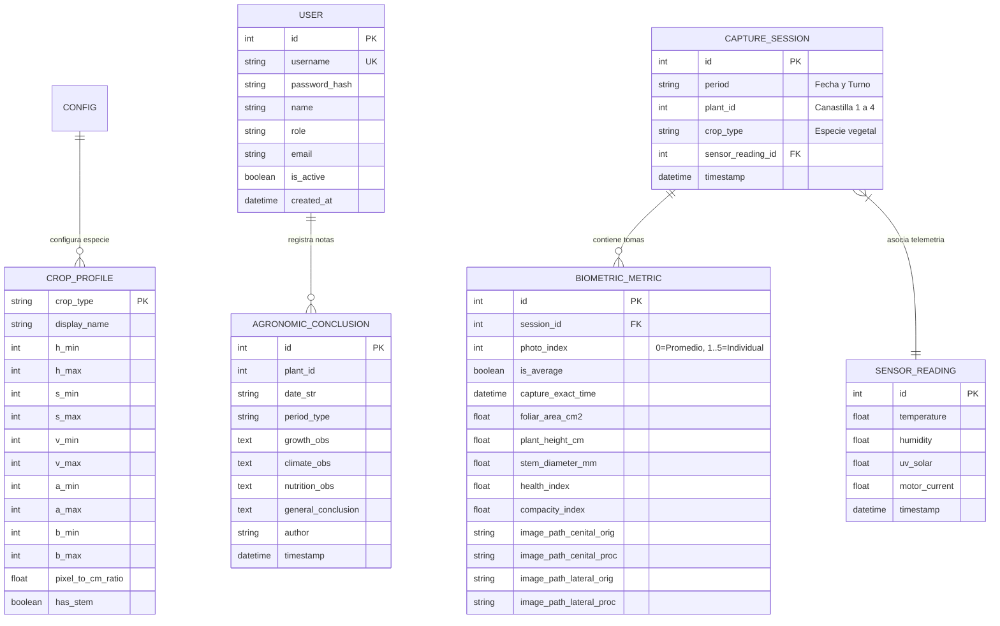

<div align="center">
  
  <h1>SIFMA</h1>
  <h3>Sistema Integrado de Fenotipado Digital y Telemetría Agronómica en Torres Hidropónicas</h3>
  <p><strong>Versión 1.1 - Documentación Técnica y Manual de Operación</strong></p>
  <p><em>Plataforma para automatización de fenotipado no destructivo, análisis biométrico por visión artificial y telemetría microclimática multivariable</em></p>
</div>

---

## 1. Resumen Ejecutivo y Propósito del Sistema

**SIFMA** es una infraestructura tecnológica integral concebida para la investigación agronómica, la optimización de cultivos y la sustentación científica en torres hidropónicas verticales. El sistema permite cuantificar con exactitud matemática la evolución morfométrica de las plantas (**área foliar fotosintéticamente activa, altura vertical, diámetro del tallo basal, compacidad e índice de salud clorofílica**) correlacionada con las variables ambientales (**temperatura, humedad relativa, radiación solar y consumo energético de la bomba**).

### Principios Fundamentales del Sistema:
1. **Fenotipado no destructivo de alta resolución**: Adquisición automatizada en ángulos cenital y lateral sin perturbar el dosel vegetal.
2. **Procesamiento de visión computacional robusto**: Pipeline híbrido basado en espacios de color HSV y CIELAB con segmentación de Otsu y contornos perimetrales en rojo.
3. **Telemetría ambiental desacoplada**: Recepción inalámbrica mediante antena USB o importación universal de registros CSV.
4. **Operación 100% autónoma y offline**: Capacidad de operar en entornos de campo sin dependencia de conectividad a internet.
5. **Generación automática de dossiers y reportes científicos**: Exportación de fichas técnicas en PDF con rigor estadístico paramétrico y suite de firma digital.

---

## 2. Topología y Arquitectura del Sistema

El sistema implementa una **Arquitectura Limpia (Clean Architecture)** distribuida en tres niveles de hardware y software:

```
+-----------------------------------------------------------------------------+
|               TORRE HIDROPÓNICA VERTICAL (CAMPO / IN-SITU)                  |
|                                                                             |
|   [ Canastilla #4 - Cúspide ]   ---> Nodo Cámara Dual (Cenital / Lateral)   |
|   [ Canastilla #3 - Medio-Alto] ---> Nodo Cámara Dual (Cenital / Lateral)   |
|   [ Canastilla #2 - Medio-Bajo] ---> Nodo Cámara Dual (Cenital / Lateral)   |
|   [ Canastilla #1 - Base ]      ---> Nodo Cámara Dual (Cenital / Lateral)   |
|                                                                             |
|   [ Estación Microclimática ]   ---> Módulo RF / Microcontrolador           |
+----------------------+------------------------------+-----------------------+
                       |                              |
              (Descarga USB / Archivo)         (Enlace Serial / RF)
                       |                              |
                       v                              v
+-------------------------------+       +-------------------------------------+
|      MEMORIA USB DE CAMPO     |       |   ANTENA RECEPTORA USB DE TELEMETRÍA|
| SIFMA_CAPTURES/YYYY-MM-DD/    |       | Transmisión inalámbrica en tiempo   |
|  [manana | mediodia | tarde]  |       | real conectada a la PC              |
+---------------+---------------+       +------------------+------------------+
                |                                          |
                +--------------------+---------------------+
                                     |
                                     v
+-----------------------------------------------------------------------------+
|                         SERVIDOR CENTRAL SIFMA (PC)                         |
|                                                                             |
|  1. Ingestión USB Automática / Carga Manual Drag & Drop                     |
|  2. Pipeline de Visión Computacional (OpenCV + NumPy + LAB + HSV)           |
|  3. Motor de Métricas Biométricas y Filtrado Estadístico (+-2 Sigma)        |
|  4. Base de Datos Relacional SQLite (sifma.db / SQLAlchemy)                 |
|  5. Motor Analítico de Correlaciones de Pearson y RGR/AGR                   |
|  6. Interfaz Web Responsiva (Glassmorphism / Chart.js / Time-Lapse)         |
|  7. Generador de Dossiers Científicos & Suite de Firma Digital              |
+-----------------------------------------------------------------------------+
```

---

## 3. Desglose Exhaustivo de Módulos y Secciones

SIFMA cuenta con una suite completa de módulos accesibles desde la barra lateral:

### 3.1. General

#### A. Resumen Diario (`/`)
* **KPIs Instantáneos**: Visualización en vivo de temperatura ambiente, humedad relativa, radiación solar, área foliar actual y altura de la canastilla activa.
* **Curva Evolutiva Multivariable**: Gráfica temporal con área foliar y condiciones microclimáticas.
* **Diagnóstico de Estado**: Indicador de confort fisiológico y resumen de la última captura.

#### B. Calendario Interactivo (`/calendar`)
* **Matriz Mensual de Muestreo**: Calendario interactivo con navegación entre meses y años.
* **Insignias de Registro**:
  * *Insignias Verdes*: Muestreos de fenotipado fotográfico procesados (número de lotes y área foliar).
  * *Insignias Azules*: Registros de telemetría de sensores disponibles (lecturas, temperatura y humedad media).
* **Modal Inspector de Jornada**: Al hacer clic sobre cualquier día del calendario, despliega el desglose hora por hora de las sesiones fotográficas y los promedios de microclima con accesos directos al Dashboard y al Reporte Científico.

---

### 3.2. Fenotipado y Visión

#### C. Procesamiento e Importación (`/processing`)
* **Detección Automática de Unidades USB**: Escaneo en caliente de memorias USB insertadas (`D:\`, etc.) para importar lotes por fecha y turno (*Mañana, Mediodía, Tarde*).
* **Carga Manual Drag & Drop**: Subida directa de archivos comprimidos `.ZIP` o imágenes individuales.
* **Barra de Progreso en Tiempo Real**: Notificación dinámica del avance de segmentación OpenCV (0% a 100%).
* **Gráficas Biométricas en Tiempo Real**:
  * Curva de Área Foliar Estimada ($cm^2$).
  * Curva de Altura Estimada de Planta ($cm$).
  * Curva de Diámetro del Tallo Basal ($mm$).
  * Curva de Índice de Salud Foliar ($\%$).
* **Comparador de Máscaras**: Visualización de la última segmentación cenital y lateral con contornos de calibración.

#### D. Galería de Lotes y Comparador de Biomasa (`/gallery`)
* **Comparador Deslizante Interactivo**: Control deslizante antes/después para cotejar la imagen original RAW con la segmentación perimetral en contorno rojo.
* **Filtros por Período**: Visualización selectiva de tomas (*Todos, Mañana, Mediodía, Tarde*).
* **Modal de Inspección Detallada**: Ampliación en alta resolución de las 5 tomas individuales que componen el promedio del lote.

#### E. Comparador Inter-Canastillas y Gradiente Vertical (`/benchmark`)
* **Superposición de Curvas Multicanastilla**: Comparación simultánea del desarrollo foliar y la altura entre la Canastilla #1, #2, #3 y #4 en un único lienzo interactivo.
* **Evaluación del Gradiente Vertical en la Torre**:
  * Estratificación por niveles: *Nivel 4 (Cúspide)*, *Nivel 3 (Medio-Alto)*, *Nivel 2 (Medio-Bajo)* y *Nivel 1 (Base)*.
  * Análisis del impacto de la posición en la torre sobre la tasa de expansión vegetativa.
* **Tasa de Crecimiento Relativo (RGR) y Absoluto (AGR)**:
  $$\text{RGR} = \frac{\ln(A_{\text{final}}) - \ln(A_{\text{inicial}})}{\Delta t} \times 100 \quad (\%/\text{día})$$
  $$\text{AGR} = \frac{\Delta A}{\Delta t} \quad (cm^2/\text{día})$$
* **Exportación de Matriz Comparativa en CSV**: Descarga directa de tablas tabuladas de rendimiento.

#### F. Time-Lapse & Evolución Biológica (`/timelapse`)
* **Motor de Reproducción Temporal**: Reproducción fluida de la secuencia biológica con velocidades variables ($0.5\times$, $1\times$, $2\times$, $4\times$), modo bucle (*Loop*) y control mediante barra espaciadora.
* **Control Deslizante Scrubber**: Desplazamiento manual fotograma a fotograma desde el primer día de cultivo hasta el último lote.
* **Selector de Ángulo de Cámara**:
  * Vista Cenital (Área foliar y clorofila).
  * Vista Lateral (Altura y tallo).
  * Vista Dual (Pantalla dividida sincronizada lado a lado).
* **Gauges Biométricos y Ambientales Dinámicos**: Indicadores analógicos/digitales que se actualizan en vivo con las métricas exactas del fotograma reproducido.
* **Carrousel de Fotogramas (Filmstrip)**: Cinta inferior de miniaturas para saltos instantáneos.

---

### 3.3. Telemetría y Ambiente

#### G. Sensores Ambientales (`/sensors`)
* **Monitoreo Microclimático**: Registro de Temperatura (°C), Humedad Relativa (%), Radiación UV (lux) y Amperaje de Bomba (A).
* **Conexión Serial USB en Vivo**: Selector de puerto COM / ttyUSB y baudrate con reconexión automática.
* **Importador Universal CSV**: Motor de lectura flexible compatible con delimitadores de coma o punto y coma, fechas simples o compuestas y formatos de hardware externos.
* **Aislamiento por Canastilla y Borrado Seguro**: Opción de compartir la telemetría en toda la torre o aislarla por perfil de canastilla con borrado individualizado sin afectar datos globales.

#### H. Cruce y Correlaciones Multivariables (`/cross_analysis`)
* **Matriz de Correlación de Pearson Multivariable (Heatmap)**: Mapa de calor cruzado que correlaciona cada sensor ambiental con cada biomarcador de la planta con cálculo del coeficiente $r$ de Pearson.
* **Laboratorio Dinámico de Cruce**: Selector libre de dos o más parámetros con generador de gráficos en tiempo real (Lineal, Barras, Radar, Polar, Dispersión).
* **Matriz de Cruce Sincronizado por Período**: Tabla técnica que desglosa lote a lote las condiciones ambientales y la respuesta morfométrica con visor de fotos integrado.
* **Escrutinio Foto a Foto**: Registro individual de cada una de las 5 tomas de cada turno con capacidad de colapsar/desplegar sesiones.
* **Bitácora Agronómica del Investigador**: Formulario para asentar observaciones cualitativas de vigor, respuesta climática y decisiones de manejo agronómico.

---

### 3.4. Generación de Informes y Publicación

#### I. Ficha Técnica y Reporte Científico en PDF (`/report/scientific`)
* **Formato Académico Certificado (IEEE / APA / Springer)**: Documento técnico listo para sustentación de tesis, anexos de investigación o bitácoras oficiales.
* **Contenido Paramétrico Riguroso**:
  * Metadatos de la muestra (ID de informe, nivel en torre, especie, fecha de muestreo).
  * Diagnóstico agronómico automatizado.
  * Matriz estadística descriptiva completa de microclima ($\mu$, $\sigma$, varianza $s^2$, mínimo, máximo, mediana, $IQR$, coeficiente de variación $CV\%$ y total de lecturas $N$).
  * Matriz estadística descriptiva de biometría foliar.
  * Matriz de correlaciones lineales de Pearson con interpretación fisiológica.
  * Desglose cronológico turno a turno.
  * **Registro Fotográfico Comparativo**: Ángulos cenital y lateral (Original RAW vs Procesada con contorno rojo) con ajuste proporcional sin recortes.
  * Anotaciones de la bitácora del investigador.
* **Suite de Firma Digital Integrada**:
  * *Subida de Imagen de Firma (PNG/JPG)*: Algoritmo de remoción automática de fondo blanco para escaneos en papel.
  * *Trazado a Mano Alzada*: Lienzo táctil y de mouse con tinta digital (*Negro Tinta* y *Azul Marino*).
  * *Campos Editables en Pantalla*: Edición directa del nombre y cargo de los evaluadores.
  * *Persistencia Local (`localStorage`)*: Opción para recordar la firma para futuros reportes.
  * *Exportación Limpia (`window.print()`)*: Impresión y guardado en PDF de alta resolución con ocultación de controles interactivos.

---

### 3.5. Configuración y Administración

#### J. Parámetros de Cultivo y Calibración Dual (`/config`)
* **Gestión de Perfiles Botánicos**: Calibración para Cebollín (*Allium schoenoprasum*), Albahaca (*Ocimum basilicum*), Lechuga (*Lactuca sativa*) y Fresa (*Fragaria*).
* **Calibración Desacoplada por Cámara (Pestañas Cenital vs Lateral)**:
  * *Cámara Cenital (Vista Superior)*: Umbrales HSV/LAB específicos y factor de escala horizontal para cuantificación milimétrica de área foliar ($cm^2$), dosel y salud de clorofila.
  * *Cámara Lateral (Perfil Vertical)*: Umbrales HSV/LAB independientes, factor de escala vertical para altura ($H$), control de área mínima de contorno (`lat_min_area`) y descarte automático de ruido en los bordes de la maceta.
* **Filtro de Cluster Central de Planta**: Aislamiento geométrico del eje del tallo para prevenir que reflejos o residuos en el borde blanco de la taza distorsionen la medición de altura.
* **Modo de Aislamiento de Telemetría**: Conmutador para compartir lecturas de sensores en toda la torre o aislar registros por canastilla.

#### K. Control de Usuarios y Roles (`/users`)
* **Administrador Principal**: Acceso total al sistema, configuración, calibración y gestión de usuarios.
* **Investigador / Agrónomo**: Acceso a procesamiento, bitácora, análisis de cruces, time-lapse y emisión de reportes.
* **Operador de Torre**: Visualización de dashboard, ingreso de datos de campo y carga de lotes.

#### L. Información del Sistema, Créditos y Licencia (`/about`)
* **Panel Institucional**: Visualización de versión oficial del software (**v1.1**), edición de investigación, topología de hardware soportada y autoría principal (Ing. Andrés Luna y colaboradores).
* **Términos de Licencia MIT**: Declaración de uso académico, científico y permisos de distribución.
* **Historial de Versiones (Changelog)**: Registro cronológico de cambios y módulos incorporados en cada actualización.

---

## 4. Pipeline de Visión Computacional (`infrastructure/vision/`)

El procesamiento de imágenes implementa un flujo matemático riguroso y desacoplado:

1. **Preprocesamiento y Filtrado de Ruido**:
   - Corrección de balance de blancos y reducción de ruido con filtro Gaussiano y operadores morfológicos elípticos adaptados por perspectiva.
2. **Segmentación Cromática Dual (ExG + HSV + CIELAB)**:
   - *Índice de Exceso de Verde (ExG)*: $2G - R - B$ con selectividad reforzada en vista lateral para anular reflejos.
   - *Espacio HSV*: Aislamiento del tono de clorofila ($H \in [h_{\min}, h_{\max}]$) y saturación vegetal con matrices independientes por cámara.
   - *Espacio CIELAB*: Discriminación de reflectancias no fotosintéticas en el plano $a^* b^*$.
   - *Fusión Lógica*:
     $$\text{Máscara Final} = \text{Máscara}_{\text{ExG}} \cap \text{Máscara}_{\text{HSV}} \cap \text{Máscara}_{\text{LAB}}$$
3. **Filtrado Espacial de Cluster Central (Vista Lateral)**:
   - Identificación del contorno representativo de la planta y descarte automático de contornos periféricos aislados (reflejos plásticos en el borde de la maceta).
4. **Extracción de Contornos y Métricas Morfométricas**:
   - **Área Foliar ($cm^2$)**:
     $$A_{\text{foliar}} = \left( \sum \text{píxeles}_{\text{planta}} \right) \times \left(\text{ratio}_{\text{px\_cm\_cenital}}\right)^2$$
   - **Altura de Planta ($cm$)**:
     $$H_{\text{planta}} = (y_{\text{base\_tallo}} - y_{\text{apical\_hoja}}) \times \text{ratio}_{\text{px\_cm\_lateral}}$$
   - **Compacidad**:
     $$\text{Compacidad} = \frac{4 \pi \cdot A_{\text{contorno}}}{P_{\text{contorno}}^2}$$
   - **Diámetro de Tallo Basal ($mm$)**: Muestreo transversal en la zona de inserción con el sustrato.
   - **Índice de Salud Foliar ($\%$)**: Proporción de píxeles en reflectancia verde saludable respecto al total del dosel.
5. **Superposición Visual de Contorno**:
   - Delimitación perimetral en **Rojo Puro** (`BGR: (0, 0, 255)`) exclusivamente sobre la planta real y línea de altura en amarillo centrada en el eje vertical.
6. **Filtrado Estadístico de Lote ($\pm 2\sigma$)**:
   - Descarte automático de fotogramas atípicos sobre las 5 capturas del muestreo para calcular el valor representativo del período.

---

## 5. Esquema de Base de Datos Relacional (`sifma.db`)



---

## 6. Requisitos y Dependencias

### 6.1. Requisitos de Software
* Python 3.10 o superior.
* Sistema Operativo: Linux (Raspberry Pi OS / Ubuntu / Debian) o Windows 10/11.
* Navegador Web Moderno (Google Chrome, Mozilla Firefox, Microsoft Edge, Safari).

### 6.2. Librerías Principales (`requirements.txt`)
```text
Flask>=3.0.0
Flask-SQLAlchemy>=3.1.0
Flask-Login>=0.6.3
Werkzeug>=3.0.0
opencv-python>=4.8.0
numpy>=1.24.0
pyserial>=3.5
gunicorn>=21.2.0
```

---

## 7. Instalación y Guía de Inicio Rápido

### Paso 1: Clonar el Repositorio
```bash
git clone https://github.com/IsAndresL/SIFMA.git
cd SIFMA
```

### Paso 2: Crear Entorno Virtual e Instalar Dependencias
```bash
# En Linux / macOS
python3 -m venv venv
source venv/bin/activate
pip install -r requirements.txt

# En Windows (PowerShell)
python -m venv venv
.\venv\Scripts\Activate.ps1
pip install -r requirements.txt
```

### Paso 3: Iniciar el Servidor Web Central
```bash
python local_server/app.py
```

### Paso 4: Acceder a la Plataforma Web
* Abrir el navegador en: **`http://127.0.0.1:5000`**
* **Credenciales por Defecto**:
  * **Usuario**: `admin`
  * **Contraseña**: `sifma2026`

### Paso 5: Ejecución del Nodo Raspberry Pi (Opcional en Campo)
```bash
python raspi_node/main_capture.py
```

---

## 8. Estructura de Directorios del Proyecto

```text
SIFMA/
|-- local_server/                    # Servidor Web y Motor Central
|   |-- app.py                       # Punto de entrada y configuracion de Flask
|   |-- application/                 # Capa de Aplicacion (Servicios y Casos de Uso)
|   |   `-- services/                # AnalyticsService, TelemetryService, SystemService
|   |-- domain/                      # Capa de Dominio (Entidades y Modelos de Negocio)
|   |   `-- models/                  # CropProfile, CaptureSession, BiometricMetric, User
|   |-- infrastructure/              # Capa de Infraestructura (DB, Sensores, OpenCV)
|   |   |-- database/                # Repositorios SQLAlchemy y conexion sifma.db
|   |   |-- telemetry/               # SerialReceiver, CSVImporter
|   |   `-- vision/                  # OpenCV Pipeline, Segmentacion HSV/LAB, Metricas
|   |-- presentation/                # Capa de Presentacion (Rutas Web y API REST)
|   |   |-- web/                     # DashboardRoutes, AuthRoutes
|   |   `-- api/                     # TelemetryRoutes, VisionRoutes, AnalyticsRoutes
|   |-- static/                      # Archivos Estaticos (CSS, JS, Imagenes, SVGs)
|   |   |-- css/                     # Estilos ejecutivos y responsivos index.css
|   |   |-- js/                      # Logica cliente dashboard.js, Chart.js
|   |   |-- img/                     # sifma_logo.svg (Emblema institucional)
|   |   `-- data/                    # Almacenamiento local de fotos y uploads
|   `-- templates/                   # Plantillas HTML5 Jinja2
|       |-- base.html                # Layout maestro y barra lateral
|       |-- dashboard.html           # Resumen diario y monitoreo
|       |-- calendar.html            # Calendario interactivo
|       |-- processing.html          # Procesamiento USB / ZIP y graficas
|       |-- gallery.html             # Galeria y comparador antes/despues
|       |-- benchmark.html           # Comparador inter-canastillas y RGR/AGR
|       |-- timelapse.html           # Time-lapse interactivo y visor biologico
|       |-- sensors.html             # Telemetria ambiental y graficos
|       |-- cross_analysis.html      # Cruce multivariable y bitacora
|       |-- scientific_report.html   # Reporte PDF y firmador digital
|       |-- config.html              # Parametros de cultivo y umbrales
|       |-- users.html               # Gestion de usuarios y roles
|       `-- login.html               # Autenticacion de usuarios
|-- raspi_node/                      # Software del Nodo de Captura Raspberry Pi
|   |-- main_capture.py              # Script principal de ejecucion
|   |-- config.py                    # Parametros de camaras e intervalos
|   `-- services/                    # CameraService, StorageService
|-- requirements.txt                 # Dependencias del proyecto
`-- README.md                        # Documentacion tecnica oficial
```

---

## 9. Despliegue en Producción

* **En la Nube (PaaS)**: Compatible con **Render.com**, **Railway.app** y **Fly.io** utilizando `gunicorn -w 2 -b 0.0.0.0:$PORT --chdir local_server app:app` con montaje de disco persistente.
* **En Servidores Locales con Acceso Remoto**: Compatible con **Cloudflare Tunnels** (`cloudflared`) para exponer el dashboard mediante HTTPS sin apertura de puertos.

---

## 10. Licencia, Autores y Créditos

* **Proyecto**: SIFMA - Sistema Integrado de Fenotipado Digital y Telemetría Agronómica en Torres Hidropónicas.
* **Autores y Desarrolladores del Software**:
  * **Ing. Andrés Luna** - *Desarrollador Principal & Arquitectura Software/Hardware* ([GitHub: @IsAndresL](https://github.com/IsAndresL))
  * **Cristian** - *Co-desarrollador de Software & Fenotipado Digital*
* **Dirección Científica & Profesores Fundadores**:
  * **Prof. Críspulo Enrique Deluque** - *Profesor Asesor & Director de Investigación*
  * **Comité Docente e Investigadores del Laboratorio**
* **Laboratorio / Entidad**: Laboratorio de Automatización, Visión Artificial & Fenotipado Digital.
* **Licencia**: MIT License - Uso académico, científico y de investigación abierta.
